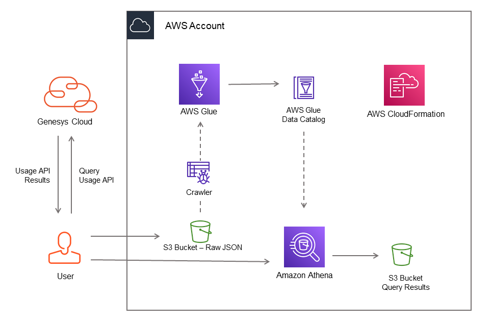

This Genesys Cloud Developer Blueprint demonstrates how to query your organization's API usage, using the Genesys Cloud CLI. Analyzing your usage is essential in optimizing and scaling any solution that uses the API. This blueprint also demonstrates an example integration by exporting the information to an AWS S3 bucket and using AWS Athena to process queries against it.

The objective of the solution is to provide a sample workflow where you can monitor, analyze, and adjust to changing growth patterns of your integration. This is not something that's often considered until it's 'too late' when there are unforeseen issues like regular rate-limitting which can impact the business. Having a system similar to this blueprint will help you track your API usage and prevent undesirable surprises caused by it.



* [Solution Components](#solution-components "Goes to the Solution Components section")
* [Implementation Steps](#implementation-steps "Goes to the Implementation Steps section")
* [Additional Resources](#additional-resources "Goes to the Additional Resources section")

## Solution Components

* **Genesys Cloud** - The Genesys cloud-based contact center platform.
* **Genesys Cloud CLI** - A standalone CLI designed for interfacing with the Genesys Cloud API.
* **jq** - jq is a lightweight and flexible command-line JSON processor. It's used to process and transform the JSON results from the Genesys Cloud API.
* **Amazon S3** - Amazon Simple Storage Service (S3) is an object storage service. S3 buckets will host the JSON data for analysis and the results of AWS Athena queries.
* **Amazon Athena** - Amazon Athena is a serverless, interactive query service to query data using standard SQL.
* **AWS Glue** - AWS Glue is a serverless ETL service. A crawler is configured to crawl an S3 path and auto-generate tables from the data files.
* **AWS CloudFormation** - AWS CloudFormation provides a template for you to model and provision AWS and third-party application resources in your cloud environment. An AWS CloudFormation template is provided to deploy the AWS components of the solution.
* **AWS CLI** - The AWS Command Line Interface (CLI) is a unified tool to manage AWS services. In keeping with the 'command line' nature of the blueprint, this is used as an optional way to execute some of the implementation steps.

## Prerequisites

### Specialized Knowledge

* Administrator-level knowledge of Genesys Cloud.
* AWS Cloud Practitioner-level knowledge of AWS CloudFormation, Amazon S3, Amazon Athena, AWS Glue, and AWS CLI.

### Command Line Tools

* [Genesys Cloud CLI](https://developer.genesys.cloud/api/rest/command-line-interface/). For this blueprint, it's assumed that the binary is located in a PATH folder and is invokeable with `gc`. If it's set-up otherwise, you may need to modify some of the sample code in the implementation steps.
* [jq - JSON Processor](https://stedolan.github.io/jq/). For this blueprint, it's assumed that the binary is located in a PATH folder and is invokeable with `jq`. If it's set-up otherwise, you may need to modify some of the sample code in the implementation steps.
* [AWS CLI](https://aws.amazon.com/cli/).
  
### Genesys Cloud account requirements

This solution requires a Genesys Cloud license. For more information on licensing, see [Genesys Cloud Pricing](https://www.genesys.com/pricing "Opens the pricing article").

A recommended Genesys Cloud role for the solutions engineer is Master Admin. For more information on Genesys Cloud roles and permissions, see the [Roles and permissions overview](https://help.mypurecloud.com/?p=24360 "Opens the Roles and permissions overview article").

### AWS account requirements

The solutions engineer requires an AWS account and administrator level credentials that allow:

* Working with AWS CloudFormation templates
* Working with AWS IAM permissions
* Creating Amazon S3 buckets
* Creating an AWS Glue datatable and crawler
* Creating an Athena Workgroup

## Implementation Steps

<!-- no toc -->
* [Query Usage API](#query-usage-api)
* [Poll the Query Status](#poll-the-query-status)
* [Transform JSON result for use with Amazon Athena](#transform-json-result-for-use-with-amazon-athena)
* [Deploy the AWS CloudFormation template](#deploy-the-aws-cloudformation-template)
* [Upload transformed JSON to S3 bucket](#upload-transformed-json-to-s3-bucket)
* [Run AWS Glue crawler](#run-aws-glue-crawler)
* [Run an Amazon Athena Query](#run-an-amazon-athena-query)

### Query Usage API

Before sending a query, you should first have a JSON file which contains the details for the query. The complete JSON body looks like this:

```json
{
  "interval": "",
  "granularity": "",
  "groupBy": [],
  "metrics": []
}
```

The 4 components of the query are:

1. `interval` (required). Defines the time period where you want to get API usage data from. This value is a date range which follows the ISO-8601 date format.

    * Ex. `2020-01-25/2020-03-10`

2. `granularity` (optional). Allows you to break the results down into buckets of `Day`, `Week`, or `Month`. If this is not set, the results returned will contain the total values for the `interval` provided.
3. `groupBy` (array, optional). Behaves like a SQL GROUPBY. Valid Values: OAuthClientId, OrganizationId, UserId, TemplateUri, HttpMethod
4. `metrics` (array, optional). Behaves like a SQL SELECT clause. If omitted, all metrics will be returned. Valid Values: Status200, Status300, Status400, Status500, Status429, Requests

Once you have a JSON file ready, you can submit a query with the following command:

```bash
gc usage query -f query-file.json
```

An alternative to having a file is building the JSON on-the-fly and piping it into gc. We've provided the following one-liner for this purpose where you can simply change the value of the jq arguments:

```bash
echo {} | jq --arg interval "2021-01/2021-02" --arg granularity "Day" --argjson groupBy '["TemplateUri"]' --argjson metrics '["Status200"]' '.interval=$interval | if $ARGS.named.granularity != null then .granularity=$ARGS.named.granularity else . end | if $ARGS.named.groupBy != null then .groupBy=$ARGS.named.groupBy else . end | if $ARGS.named.metrics != null then .metrics=$ARGS.named.metrics else . end' | gc usage query
```

:::primary
**Note**: For the one-liner, you could remove the optional arguments that you do not need.
:::

Once you have submitted the query, the CLI should give you an output similar to this:

```json
{
  "executionId": "7157a113-2751-4e38-85c4-c386cb9e22a4",
  "resultsUri": "/api/v2/usage/query/7157a113-2751-4e38-85c4-c386cb9e22a4/results"
}
```

### Poll the Query Status

To retrieve the query, you need to present the `executionId` to the Usage API with the following command:

```bash
gc usage results 7157a113-2751-4e38-85c4-c386cb9e22a4
```

If the query is not yet complete, you will get back a JSON payload indicating the query is `Running`:

```json
{
  "queryStatus": "Running"
}
```

If the query is completed, you will get a query payload back with the `queryStatus` equal to `Complete`. The payload will also contain the query results for the query submitted.

Example of a completed query:

```json
{
  "results": [
    {
      "clientId": "e7de8a75-86bb-43eb-9063-38699f8c21af",
      "clientName": "Prince Implicit Grant",
      "organizationId": "",
      "userId": "",
      "templateUri": "",
      "httpMethod": "",
      "status200": 57,
      "status300": 0,
      "status400": 0,
      "status500": 0,
      "status429": 0,
      "requests": 57
    },
    {
      "clientId": "257acb58-bf3e-4e01-afd2-ae00a848fe",
      "clientName": "Github Pages (implicit)",
      "organizationId": "",
      "userId": "",
      "templateUri": "",
      "httpMethod": "",
      "status200": 10,
      "status300": 0,
      "status400": 0,
      "status500": 0,
      "status429": 0,
      "requests": 10
    },
    ...  Data truncated for conciseness
  ],
  "queryStatus": "Complete"
}
```

By this step, you should already have the Usage API data that you need and can perform further analysis or transformation with it. The rest of the blueprint is optional but shows you how to load this data for use with Amazon Athena.

### Transform JSON result for use with Amazon Athena

Once the query is completed, the resulting data should be transformed into a different JSON format where each record is its own line in the file.

To do this, you could run this one-liner which pipes the usage results into a jq transformation command, then finally saving the new format into a new file:

```bash
gc usage results "7157a113-2751-4e38-85c4-c386cb9e22a4" | jq -c '.results[]' > query-result.json
```

Resulting file content:

```json
{"clientId":"d57acb58-54a8-44ce-bafa-0c273a357a94","clientName":"Sample Client Credentials","organizationId":"","userId":"","templateUri":"","httpMethod":"","status200":3,"status300":0,"status400":0,"status500":1,"status429":0,"requests":4,"date":"2021-01-12T00:00:00Z"}
{"clientId":"47de8a75-c884-487c-bd30-f4b476622bb7","clientName":"Another OAUth Client","organizationId":"","userId":"","templateUri":"","httpMethod":"","status200":16,"status300":0,"status400":0,"status500":0,"status429":0,"requests":16,"date":"2021-01-29T00:00:00Z"}
...
```

:::primary
**Important**: This step and file format is required so you could use the JSON for Athena.
:::

### Deploy the AWS CloudFormation template

Download the template here: [usage-api.template.yaml](src/usage-api.template.yaml)

The AWS CloudFormation template creates an AWS stack which contains the following Amazon resources:

* S3 bucket for hosting raw JSON data
* S3 bucket for results of Amazon Athena queries
* Policy, Role, Database, and Crawler for AWS Glue
* Athena Workgroup

To deploy the template, complete the following:

1. Log into AWS console.
2. Click on the [CloudFormation service](https://console.aws.amazon.com/cloudformation/home#/stacks/create/template) to a create a new stack.
3. Confirm the default selections of **Template is ready** and select **Upload a template file**
4. Upload the **usage-api.template.yaml** file you've downloaded earlier.
5. Click **Next** and finish the process. There are no additional parameters to be configured.

:::primary
**Note**: The creation process may take several minutes. Make sure that it's completed before proceeding.
:::

:::warning
**Warning**: Most of the resources provisioned have explicitly set names for use in the succeeding steps. If the creation process fails due to a naming conflict with existing objects, you may need to modify the template.
:::

### Upload transformed JSON to S3 bucket

After the CloudFormation stack finishes its creation process, you can now upload the transformed JSON file that was created earlier. 

If you have the AWS CLI configured and ready to use, you can simply call this command from your command line.

```bash
aws s3 cp query-result.json s3://gc-usage-api-source
```

If you prefer to use the web AWS Console, you can follow these [instructions](https://docs.aws.amazon.com/quickstarts/latest/s3backup/step-2-upload-file.html) from the AWS documentation.

### Run AWS Glue crawler

Once all the data is uploaded to the `gc-usage-api-source` bucket, you need to run the crawler to generate the table definitions. This crawler is configured to run on demand so we need to manually run it everytime there is a change in the bucket.

```bash
aws glue start-crawler --name UsageApiCrawler
```

Depending on the amount of data, the crawler can take up to several minutes. You can poll the status of the crawler with this one-liner:

```bash
aws glue get-crawler --name UsageApiCrawler | jq '.Crawler.State'
```

If the crawler state is `READY`, then it can be used with Athena for querying.

### Run an Amazon Athena Query

Everything should now be set up for querying the data with Amazon Athena. In this example, we'll request the first 10 entries of the table:

```bash
aws athena start-query-execution --query-string "SELECT * FROM "genesysclouddb"."gc_usage_api_source" limit 10;" --work-group "UsageAPIWorkgroup" --query-execution-context Database=genesyscloud,Catalog=AwsDataCatalog
```

By default, queries will be saved to the `gc-usage-api-results` bucket.
If everything's been setup sucessfully it'd be easy to integrate with other Amazon services.

## Additional Resources

* [Genesys Cloud Developer Center](https://developer.mypurecloud.com/)
* [Understanding your Genesys Cloud API usage](https://developer.mypurecloud.com/blog/2021-01-04-API-Usage/)
* [Rate Limits](https://developer.genesys.cloud/api/rest/rate_limits)
* [Amazon Athena - Best Practices for Reading JSON Data](https://docs.aws.amazon.com/athena/latest/ug/parsing-JSON.html)


